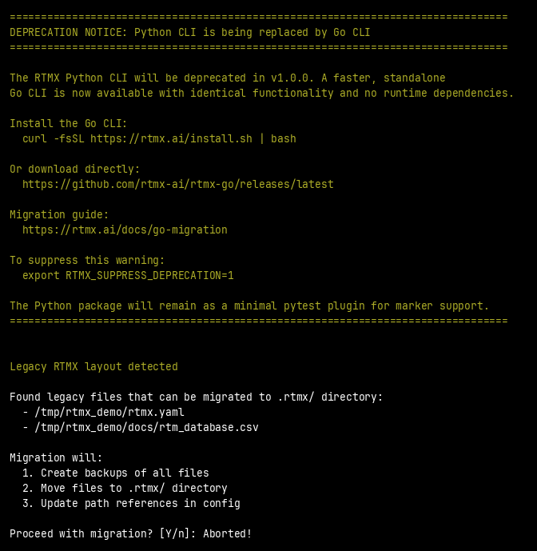
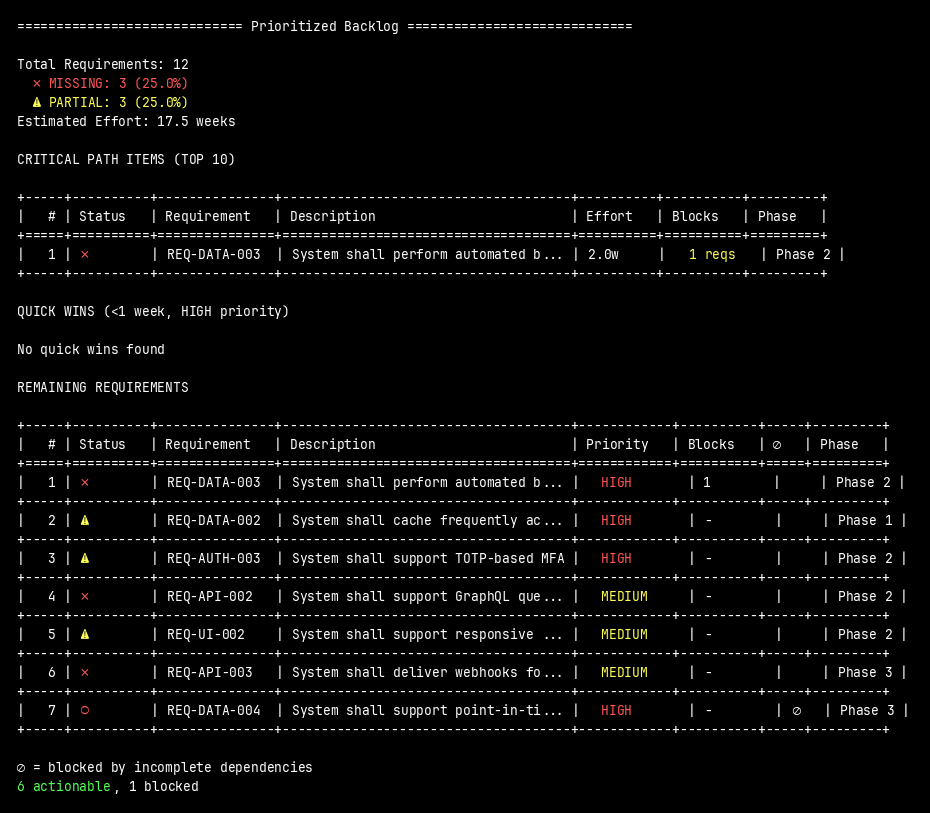
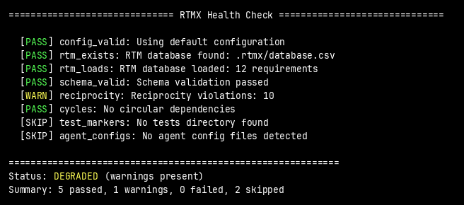

# RTMX

**Requirements Traceability Matrix toolkit for AI-driven development.**

[](https://github.com/iotactical/rtmx/actions/workflows/ci.yml)
[](https://coveralls.io/github/iotactical/rtmx?branch=main)
[](https://pypi.org/project/rtmx/)
[](https://pypi.org/project/rtmx/)
[](https://github.com/iotactical/rtmx/blob/main/LICENSE)

---

RTMX brings **requirements traceability** to modern software development. Track what you're building, why you're building it, and prove it works—all from your terminal.

**[Documentation](https://iotactical.github.io/rtmx/)** · **[Quickstart](https://iotactical.github.io/rtmx/quickstart)** · **[RTMX Sync](https://iotactical.github.io/rtmx/pricing)**



## Why RTMX?

**For AI-assisted development**, RTMX provides the context AI agents need:
- Token-efficient CSV format that fits in context windows
- Clear requirement IDs for precise references (`REQ-AUTH-001`)
- Dependency graphs that show what to build next
- MCP server for real-time AI agent integration

**For teams**, RTMX brings clarity:
- One command to see project progress: `make rtm`
- Prioritized backlog with blocking dependencies
- Tests linked directly to requirements

**For compliance**, RTMX provides traceability:
- Every requirement linked to its test
- Audit-ready CSV database (version-controlled, diff-friendly)
- Validation that catches gaps before reviewers do

## Security

RTMX is designed with security-first principles:

| Property | Description |
|----------|-------------|
| **Local-first** | Your data stays on your machine—no cloud required |
| **Git-native** | Full version history and audit trail via git |
| **Human-readable** | CSV format is auditable, no opaque databases |
| **Open source** | MIT license, fully auditable codebase |
| **No telemetry** | Zero data collection in the core tool |

**RTMX Sync** (coming soon) adds real-time collaboration with end-to-end encryption, SSO/SAML, and on-premises deployment options for defense and regulated industries.

## Installation

```bash
pip install rtmx
```

## Quick Start

### 1. Set up RTMX in your project

```bash
rtmx setup
```

This creates everything you need:
- `rtmx.yaml` — Configuration file
- `docs/rtm_database.csv` — Requirements database
- `docs/requirements/` — Requirement specification files
- Makefile targets (`make rtm`, `make backlog`)
- AI agent configs (CLAUDE.md, .cursorrules)

For existing projects, use `--branch` to review changes before merging:

```bash
rtmx setup --branch    # Creates a git branch for review
rtmx setup --pr        # Creates branch + opens PR
```

### 2. Check your status

```bash
rtmx status -v    # Verbose output with category breakdown
rtmx status -vv   # Very verbose with requirement details
rtmx status -vvv  # Maximum detail
```

### 3. See what to work on next



### 4. Run health checks



## AI Agent Integration

RTMX provides an MCP (Model Context Protocol) server for seamless AI agent integration:

```bash
rtmx mcp-server
```

This allows AI assistants like Claude to:
- Query project status and requirements
- Understand what to build next
- Check dependencies and blockers
- Validate changes against requirements

Configure in your MCP client:
```json
{
  "mcpServers": {
    "rtmx": {
      "command": "rtmx",
      "args": ["mcp-server"]
    }
  }
}
```

## Pytest Integration

Link your tests directly to requirements:

```python
import pytest

@pytest.mark.req("REQ-AUTH-001")
@pytest.mark.scope_unit
def test_oauth_login():
    """Validates REQ-AUTH-001: OAuth 2.0 authentication."""
    assert authenticate_user(token) == expected_user
```

RTMX automatically tracks which requirements have tests and which don't.

**Available markers:**

| Marker | Purpose |
|--------|---------|
| `@pytest.mark.req("REQ-XXX-NNN")` | Links test to requirement |
| `@pytest.mark.scope_unit` | Unit test scope |
| `@pytest.mark.scope_integration` | Integration test scope |
| `@pytest.mark.scope_system` | System/E2E test scope |

## Commands

### Core Commands

| Command | Description |
|---------|-------------|
| `rtmx setup` | Complete RTMX setup (config, RTM, agents, Makefile) |
| `rtmx init` | Minimal setup (config and RTM database only) |
| `rtmx status` | Show completion progress (`-v`, `-vv`, `-vvv` for detail) |
| `rtmx backlog` | Show prioritized incomplete requirements |
| `rtmx health` | Run integration health checks |
| `rtmx config` | Show or validate configuration |

### Analysis Commands

| Command | Description |
|---------|-------------|
| `rtmx deps` | Show dependency graph |
| `rtmx cycles` | Detect circular dependencies |
| `rtmx reconcile` | Check/fix dependency reciprocity |
| `rtmx analyze` | Discover requirements from project artifacts |
| `rtmx diff` | Compare RTM versions (for PRs) |

### Integration Commands

| Command | Description |
|---------|-------------|
| `rtmx from-tests` | Scan tests for requirement markers |
| `rtmx bootstrap` | Generate RTM from tests, GitHub, or Jira |
| `rtmx sync` | Synchronize with GitHub Issues or Jira |
| `rtmx install` | Install prompts into AI agent configs |
| `rtmx makefile` | Generate Makefile targets |
| `rtmx mcp-server` | Start MCP server for AI agent integration |

## Makefile Integration

After `rtmx setup`, you get these Makefile targets:

```bash
make rtm       # Quick status check
make backlog   # See what's next
make health    # Run health checks
```

## Python API

```python
from rtmx import RTMDatabase, Status

# Load and query
db = RTMDatabase.load("docs/rtm_database.csv")
incomplete = db.filter(status=Status.MISSING)
phase1 = db.filter(phase=1)

# Graph operations
cycles = db.find_cycles()
blockers = db.critical_path()

# Validation
errors = db.validate()
violations = db.check_reciprocity()

# Modify and save
db.update("REQ-SW-001", status=Status.COMPLETE)
db.save()
```

## Configuration

`rtmx.yaml`:

```yaml
rtmx:
  database: docs/rtm_database.csv
  requirements_dir: docs/requirements
  schema: core
  pytest:
    marker_prefix: "req"
    register_markers: true
```

## RTM Schema

The CSV database includes these columns:

| Column | Required | Description |
|--------|----------|-------------|
| `req_id` | Yes | Unique identifier (e.g., `REQ-AUTH-001`) |
| `category` | Yes | High-level grouping |
| `requirement_text` | Yes | Human-readable description |
| `status` | Yes | `COMPLETE`, `PARTIAL`, `MISSING`, `NOT_STARTED` |
| `priority` | No | `P0`, `HIGH`, `MEDIUM`, `LOW` |
| `phase` | No | Development phase number |
| `dependencies` | No | Pipe-separated req IDs this depends on |
| `blocks` | No | Pipe-separated req IDs this blocks |
| `test_module` | No | Test file path |
| `test_function` | No | Test function name |

See the [schema documentation](https://iotactical.github.io/rtmx/guides/schema) for the complete schema.

## CI/CD Integration

RTMX provides GitHub Actions workflows:

**Health check on every push:**
```yaml
- run: pip install rtmx
- run: rtmx health --format ci
```

**RTM diff on pull requests:**
```yaml
- run: |
    git show origin/main:docs/rtm_database.csv > base.csv
    rtmx diff base.csv docs/rtm_database.csv --format markdown
```

## Development

```bash
git clone https://github.com/iotactical/rtmx.git
cd rtmx
make dev      # Install with dev dependencies
make test     # Run tests
make lint     # Run linter
```

## License

MIT License — see [LICENSE](LICENSE) for details.

## Contributing

Contributions welcome! Please read our contributing guidelines before submitting PRs.

---

<p align="center">
  <strong>Built by <a href="https://iotactical.co">ioTACTICAL Engineering</a></strong><br>
  <a href="mailto:engineering@iotactical.co">engineering@iotactical.co</a>
</p>
