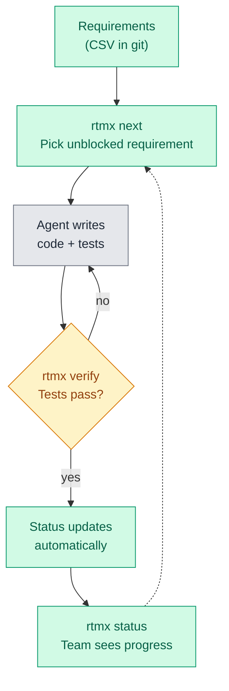
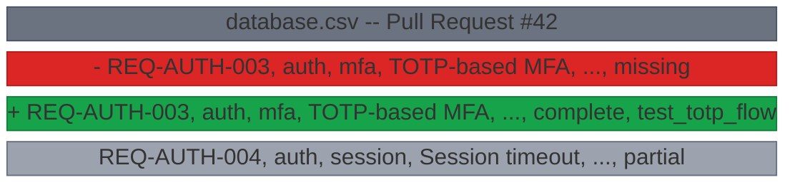
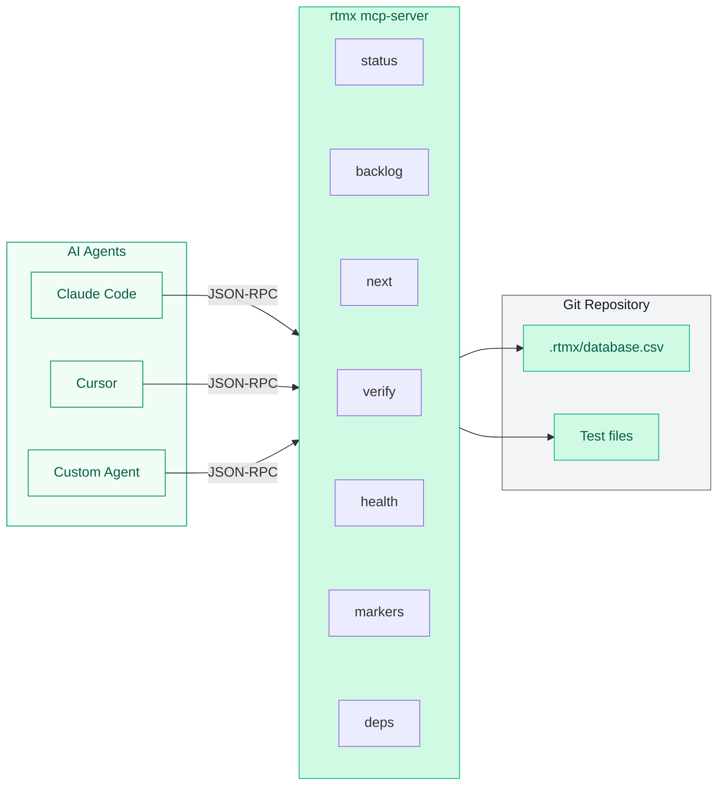

# RTMX

**Track what you built, what's tested, and what's next -- from the terminal.**

[](https://github.com/rtmx-ai/rtmx/actions/workflows/ci.yml)
[](https://coveralls.io/github/rtmx-ai/rtmx?branch=main)
[](https://goreportcard.com/report/github.com/rtmx-ai/rtmx)
[](LICENSE)


RTMX is a CLI that manages requirements traceability as a CSV file in git.
Every requirement has an ID, a spec, and linked tests. Status is derived
from test results -- not manually updated. AI agents query your requirements
via MCP and build against your intent, not their own.

## Install

```bash
brew install rtmx-ai/tap/rtmx        # macOS / Linux
scoop install rtmx                    # Windows
go install github.com/rtmx-ai/rtmx/cmd/rtmx@latest
```

Or download a binary from [releases](https://github.com/rtmx-ai/rtmx/releases).

## What It Does

| Command | What it does |
|---------|-------------|
| `rtmx status` | Completion dashboard across all requirements and phases |
| `rtmx next --one` | Pick the highest-priority unblocked requirement |
| `rtmx verify` | Run tests and cross-reference against requirements |
| `rtmx health` | Lint your RTM: orphaned tests, circular deps, stale refs |
| `rtmx backlog` | Prioritized work items with critical path analysis |
| `rtmx mcp-server` | 10 tools for AI agents over JSON-RPC (read + write) |

42 commands total. Run `rtmx --help` for the full list.

## The AI Workflow


```mermaid
flowchart TD
    A["Requirements\n(CSV in git)"] --> B["rtmx next\nPick unblocked requirement"]
    B --> C["Agent writes\ncode + tests"]
    C --> D{"rtmx verify\nTests pass?"}
    D -- yes --> E["Status updates\nautomatically"]
    D -- no --> C
    E --> F["rtmx status\nTeam sees progress"]
    F -.-> B

    style A fill:#d1fae5,stroke:#059669,color:#065f46
    style B fill:#d1fae5,stroke:#059669,color:#065f46
    style C fill:#e5e7eb,stroke:#6b7280,color:#1f2937
    style D fill:#fef3c7,stroke:#d97706,color:#92400e
    style E fill:#d1fae5,stroke:#059669,color:#065f46
    style F fill:#d1fae5,stroke:#059669,color:#065f46
```

An agent runs `rtmx next --one`, gets a specific requirement, writes code
and tests against the spec, and `rtmx verify` confirms the work is done.
No human triages, assigns, or updates a ticket.

## Why CSV in Git


```mermaid
block-beta
    columns 1
    block:header["database.csv -- Pull Request #42"]
        columns 1
    end
    block:removed["- REQ-AUTH-003, auth, mfa, TOTP-based MFA, ..., missing"]
        columns 1
    end
    block:added["+ REQ-AUTH-003, auth, mfa, TOTP-based MFA, ..., complete, test_totp_flow"]
        columns 1
    end
    block:context["  REQ-AUTH-004, auth, session, Session timeout, ..., partial"]
        columns 1
    end

    style header fill:#6b7280,stroke:#4b5563,color:#ffffff
    style removed fill:#dc2626,stroke:#b91c1c,color:#ffffff
    style added fill:#16a34a,stroke:#15803d,color:#ffffff
    style context fill:#9ca3af,stroke:#6b7280,color:#ffffff
```

- **Human-readable diffs** in PRs -- one row changed, one requirement done
- **Works everywhere** -- offline, air-gapped, no database, no API
- **AI agents parse it** without an SDK -- it's a file
- **git blame** tells you when and why every requirement changed
- **No vendor lock-in** -- it's your data in your repo

## MCP Integration


```mermaid
flowchart LR
    subgraph agents["AI Agents"]
        direction TB
        A1["Claude Code"]
        A2["Cursor"]
        A3["Custom Agent"]
    end

    subgraph mcp["rtmx mcp-server"]
        direction TB
        T1["status"]
        T2["backlog"]
        T3["next"]
        T4["verify"]
        T5["health"]
        T6["markers"]
        T7["deps"]
        T1 ~~~ T2 ~~~ T3 ~~~ T4 ~~~ T5 ~~~ T6 ~~~ T7
    end

    subgraph repo["Git Repository"]
        direction TB
        DB[".rtmx/database.csv"]
        Tests["Test files"]
    end

    A1 -- "JSON-RPC" --> mcp
    A2 -- "JSON-RPC" --> mcp
    A3 -- "JSON-RPC" --> mcp
    mcp --> DB
    mcp --> Tests

    style agents fill:#f0fdf4,stroke:#059669,color:#065f46
    style mcp fill:#d1fae5,stroke:#10b981,color:#065f46
    style repo fill:#f3f4f6,stroke:#6b7280,color:#111827
    style A1 fill:#f0fdf4,stroke:#059669,color:#065f46
    style A2 fill:#f0fdf4,stroke:#059669,color:#065f46
    style A3 fill:#f0fdf4,stroke:#059669,color:#065f46
    style DB fill:#d1fae5,stroke:#10b981,color:#065f46
    style Tests fill:#d1fae5,stroke:#10b981,color:#065f46
```

10 tools total -- 7 read tools (`status`, `backlog`, `next`, `verify`, `health`,
`markers`, `deps`) plus 3 mutation tools (`claim`, `release`, `release_assign`)
with agent authorization and atomic locking for multi-agent coordination.
Run `rtmx mcp-server` to start.

## Test Verification

`rtmx verify` auto-detects your test framework. No configuration needed.

Go, Python/pytest, Rust/Cargo, Node.js/npm, Java/Gradle, Java/Maven,
Elixir/Mix, Swift, Dart, Ruby -- 10+ frameworks supported.

## Dogfooding

RTMX manages its own requirements. 230 requirements across 25 phases,
auto-verified in CI on every push. Run `rtmx status` in this repo to see it.

[Read the backstory](https://rtmx.ai/blog/show-hn-rtmx) -- how and why this tool was built.

## Technical Details

- Single static binary -- Go, `CGO_ENABLED=0`, zero runtime dependencies
- Linux, macOS, Windows -- amd64 and arm64
- 2 external dependencies (Cobra + YAML parser)
- GPG-signed releases with SBOM
- Apache 2.0

## Contributing

See [CONTRIBUTING.md](CONTRIBUTING.md) for development setup, building,
and testing instructions.

### Migrating from Python CLI

> **Deprecation Notice:** The Python `rtmx` CLI is deprecated and will reach
> end-of-life on 2026-09-25. Run `pip uninstall rtmx` and switch to the Go
> binary above.

See [docs/MIGRATION.md](docs/MIGRATION.md) for full migration steps.

## Support

- Documentation: [rtmx.ai](https://rtmx.ai)
- Issues: [github.com/rtmx-ai/rtmx/issues](https://github.com/rtmx-ai/rtmx/issues)
- Email: dev@rtmx.ai
